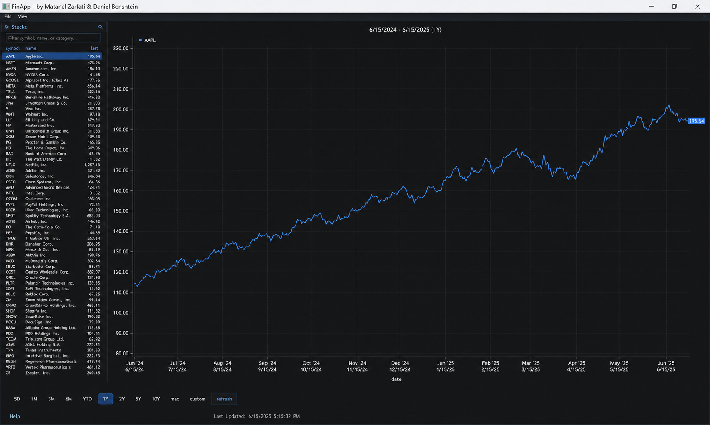

# FinApp

| Field        | Details                              |
| ------------ | ------------------------------------ |
| Authors      | Matanel Zarfati and Daniel Benshtein |
| Project Type | B.Sc. Computer Science Final Project |
| Language     | C++                                  |
| License      | MIT License                          |

FinApp is a C++ desktop application for tracking and visualizing capital market data.
The application provides a graphical interface for browsing stocks, viewing historical price charts, refreshing market data through HTTP/S requests, and saving runtime logs for monitoring application activity.

The project was developed as a Computer Science final project and focuses on C++ programming, GUI development, data handling, multithreading, logging, and third-party library integration.

---

## Demo



---

## Overview

FinApp allows users to explore stock market data through a desktop interface built with Dear ImGui, GLFW, OpenGL3, and ImPlot.

The application displays a list of stocks, allows the user to select a symbol, and visualizes historical stock price data over different time ranges.
Market data is retrieved through HTTP/S requests, parsed from JSON, processed by the application, and presented in an interactive chart-based interface.

The project also includes a logging mechanism that writes application activity and runtime events into a dedicated `Logs_FinApp/` directory.

This project demonstrates practical use of modern C++ concepts together with external libraries for UI, networking, JSON parsing, logging, multithreading, and data visualization.

---

## Features

* Desktop GUI for capital market tracking
* Stock list with company names, symbols, and latest prices
* Historical price chart visualization
* Support for multiple time ranges
* HTTP/S data fetching
* JSON parsing and data processing
* Interactive UI built with Dear ImGui
* Chart rendering with ImPlot
* File handling using C++ filesystem and fstream
* Runtime logging into a dedicated `Logs_FinApp/` directory
* Multithreading with atomic and mutex synchronization
* Third-party library integration

---

## Technologies

* C++
* Dear ImGui
* GLFW
* OpenGL3
* ImPlot
* cpp-httplib
* OpenSSL
* nlohmann/json
* stb
* STL containers
* Filesystem and fstream
* Threads, atomic, and mutex

---

## Project Structure

```text
FinApp.sln
FinApp_glfw_opengl3/
  FinApp_client.cpp
  gui.cpp
  gui.h
  logger.cpp
  logger.h
  macros.h
  stocks.cpp
  stocks.h
  ca-bundle.crt
  libcrypto-3-x64.dll
  libssl-3-x64.dll
  imgui.ini
  Logs_FinApp/
  Resource Files/
libs/
  cpp-httplib/
  ImGui/
  ImPlot/
  nlohmann/
  stb/
assets/
  FinApp_Demo.png
README.md
LICENSE
.gitignore
```

---

## Main Technical Requirements Covered

This project was developed according to academic project requirements and includes:

* Use of STL containers such as vectors and unordered maps
* Use of iterators and search operations
* File handling with `filesystem` and `fstream`
* Reading and writing local files
* Runtime logging into local files
* Multithreading using C++ threads
* Synchronization with atomic variables and mutexes
* Integration of third-party libraries
* HTTP/S requests to retrieve market data
* JSON data parsing and processing
* GUI-based presentation and user interaction

---

## Third-Party Libraries

* [Dear ImGui](https://github.com/ocornut/imgui) — graphical user interface
* [ImPlot](https://github.com/epezent/implot) — plotting and chart visualization
* [GLFW](https://www.glfw.org/) — window and input handling
* [cpp-httplib](https://github.com/yhirose/cpp-httplib) — HTTP/S requests
* [nlohmann/json](https://github.com/nlohmann/json) — JSON parsing
* [OpenSSL](https://www.openssl.org/) — SSL support for secure requests
* [stb](https://github.com/nothings/stb) — single-file public domain libraries

---

## How to Build and Run

This project was developed as a Visual Studio C++ solution.

### Build steps

1. Clone the repository:

```bash
git clone git@github.com:matanelzarfati/FinApp.git
```

2. Open the solution file:

```text
FinApp.sln
```

3. Build the project in Visual Studio.

4. Run the application from Visual Studio.

---

## Notes

* This project is intended for academic and portfolio purposes.
* Market data availability may depend on the API/source used by the application.
* The application is not intended to provide financial advice.
* Runtime logs are generated and stored under the `Logs_FinApp/` directory.
* Some third-party dependencies are included under the `libs/` directory.
* The project was originally developed as a final project instead of an exam.

---

## What I Learned

* Building a desktop application in C++
* Designing an interactive GUI with Dear ImGui
* Rendering financial charts with ImPlot
* Fetching data using HTTP/S requests
* Parsing and processing JSON data
* Managing local files with filesystem and fstream
* Implementing runtime logging
* Using multithreading and synchronization in C++
* Structuring a larger C++ project with third-party libraries

---

## Future Improvements

* Add support for more market data sources
* Add portfolio tracking features
* Add watchlists and saved user preferences
* Improve error handling for network and API failures
* Improve log filtering and log viewer support
* Add export options for charts or stock data
* Add a cleaner cross-platform build setup with CMake

---

## Development Team

* [Matanel Zarfati](https://github.com/matanelzarfati)
* [Daniel Benshtein](https://github.com/Grayscale-Nut)

---

## License

This project is licensed under the MIT License.
See the [LICENSE](LICENSE) file for details.
